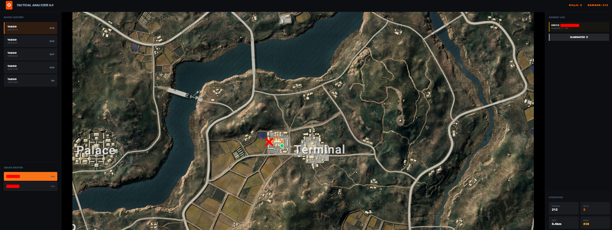
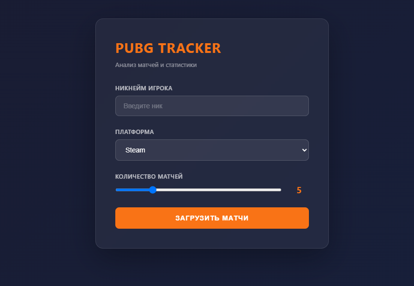

# PUBG Tracker



Local PUBG match analyzer built around an interactive tactical map. Search a
player, load recent matches, select a squad member and review movement,
combat events and key statistics in one focused interface.

Built with Python, the official PUBG API and a lightweight browser UI. The
API key stays on the local machine and is never sent to the browser.

## Features

- Search a player by nickname and platform.
- Load the latest 1–20 matches.
- Review placement, kills, damage and distance for the squad.
- Render movement, kills, knockdowns, zones and telemetry events.
- Pan, zoom and inspect events directly on the tactical map.
- Switch between match history and squad members without leaving the map.
- Cache map assets locally after the first request.
- Keep the PUBG API key outside source control.

## Screenshots

| View | Preview |
|---|---|
| Start screen |  |
| Tactical map |  |

## Requirements

- Python 3.10+
- A PUBG Developer API key
- Internet access for API, telemetry and first-time map downloads

## Get a PUBG API key

1. Open the [official PUBG Developer Portal](https://developer.pubg.com/).
2. Sign in with your PUBG developer account.
3. Create an application and copy its API key.
4. Keep the key private and configure it through the environment variable
   shown below.

The API has rate limits. Use the application responsibly and follow the
current PUBG API terms and documentation.

## Installation and configuration

Install dependencies:

```powershell
python -m pip install -r requirements.txt
```

Configure the key only in the process environment:

```powershell
$env:PUBG_API_KEY = "YOUR_PUBG_API_KEY"
python app.py
```

Open [`http://localhost:8000/start`](http://localhost:8000/start) in your
browser. On Windows, `start.bat` launches the application from its own
directory.

## Usage

1. Enter a PUBG nickname.
2. Select Steam, Kakao, PlayStation, Xbox or Stadia.
3. Choose the number of recent matches.
4. Select a match in the history panel.
5. Select a squad member to draw their route and events on the map.
6. Use the right panel for the combat log and compact player statistics.

## Project structure

```text
PUBG-tracker/
├── app.py                 # Local API proxy and telemetry loader
├── index.html             # Tactical map interface
├── start.html             # Search screen
├── start.bat              # Windows launcher
├── requirements.txt       # Python dependencies
├── docs/images/            # Project screenshots
├── maps/                  # Runtime cache, ignored by Git
└── vers/                  # Local development archives, ignored by Git
```

## Architecture

```text
Browser → Local Python proxy :8000
                       ├── PUBG API: player and match metadata
                       ├── PUBG telemetry: movement and events
                       └── PUBG map assets: local cache in maps/
```

The browser never receives the API key. The local Python process makes
authenticated requests to the PUBG API.

## Security

- `PUBG_API_KEY` is read from the environment or a local ignored `.env` file.
- Never commit `.env` files, API keys, tokens or personal data.
- Large downloaded maps and old ZIP archives are intentionally ignored.
- Revoke and replace a key immediately if it was ever exposed.

## Known limitations

- Data depends on PUBG API availability and rate limits.
- Map assets can be large and are downloaded on first use.
- The current server is intended for local use, not public hosting.

## License

This project is distributed under the [MIT License](LICENSE).

PUBG, PUBG API and related game assets remain subject to their respective
trademarks, copyrights and terms of use.
